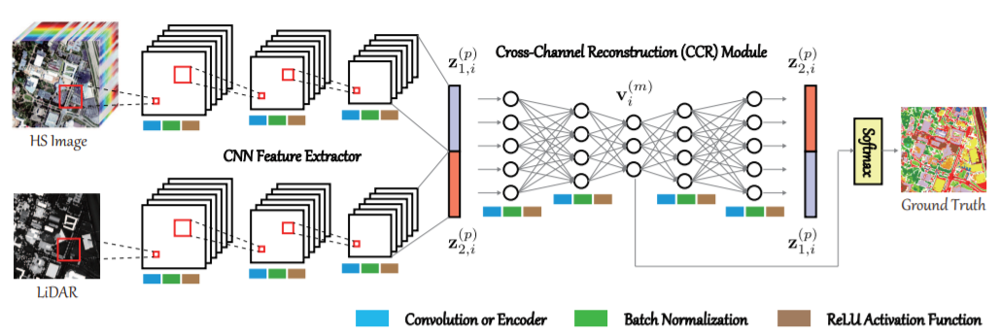

# Convolutional Neural Networks for Multimodal Remote Sensing Data Classification

[Xin Wu](https://scholar.google.com/citations?user=XzV9xYIAAAAJ&hl=en), [Danfeng Hong](https://sites.google.com/view/danfeng-hong), [Jocelyn Chanussot](http://jocelyn-chanussot.net/)

___________

The code in this toolbox implements the ["Convolutional Neural Networks for Multimodal Remote Sensing Data Classification"](https://ieeexplore.ieee.org/abstract/document/9598903). More specifically, it is detailed as follow.

Citation
---------------------

**Please kindly cite the papers if this code is useful and helpful for your research.**

Xin Wu, Danfeng Hong, Jocelyn Chanussot. Convolutional Neural Networks for Multimodal Remote Sensing Data Classification, IEEE Transactions on Geoscience and Remote Sensing, 2022, vol. 60, pp. 1-10, DOI: 10.1109/TGRS.2021.3124913. 

     @article{wu2022convolutional,
      title     = {Convolutional Neural Networks for Multimodal Remote Sensing Data Classification},
      author    = {X. Wu and D. Hong and J. Chanussot},
      journal   = {IEEE Trans. Geosci. Remote Sens.}, 
      volume    = {60},
      number    = {},
      pages     = {1-10},
      year      = {2022},
      note      = {DOI: 10.1109/TGRS.2021.3124913},
      publisher = {IEEE}
     }

System-specific notes
---------------------
The data were generated by Matlab R2016a or higher versions, and the codes of various networks were tested in Tensorflow 1.14 version in Python 3.7 on Windows 10 machines.

How to use it?
---------------------
To begin with, the data should be imported, e.g., the used Houston2013 (including hyperspectral and LiDAR data). Due to their too large file size, you can download them from the following links of google drive or baiduyun:

Google drive: https://drive.google.com/file/d/1wjSQyYuJ5uEjxakszwUa2DLyVAg3M78X/view?usp=sharing

Baiduyun: https://pan.baidu.com/s/1voUL8vqc-qVvnjquxbCXcQ (access code: urna)

Once the data are ready, you can directly run the MuCNN_train.py for the model training.

Then, the MuCNN_test.py can be used for generating the whole classification map.

If you encounter the bugs while using this code, please do not hesitate to contact us.

Licensing
---------

Copyright (C) 2021 Danfeng Hong

This program is free software: you can redistribute it and/or modify it under the terms of the GNU General Public License as published by the Free Software Foundation, version 3 of the License.

This program is distributed in the hope that it will be useful, but WITHOUT ANY WARRANTY; without even the implied warranty of MERCHANTABILITY or FITNESS FOR A PARTICULAR PURPOSE. See the GNU General Public License for more details.

You should have received a copy of the GNU General Public License along with this program.

Contact Information:
--------------------

Danfeng Hong: hongdf@aircas.ac.cn 
Danfeng Hong is with the Key Laboratory of Computational Optical Imaging Technology, Aerospace Information Research Institute, Chinese Academy of Sciences, Beijing 100094, China.
